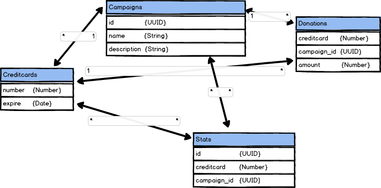

# Create, Read, Update & Delete (CRUD)

## Create

Indsæt data i databasen. Du kan bruger [faker.js](https://www.npmjs.com/package/faker) til at generere test data.

Installér Faker.js via `npm i faker`.
Efterfølgende kan ud bruge nodejses [`require`](https://nodejs.org/api/modules.html)
funktion.

```js
const faker = require("faker")
```

>*Tip* For at lave en `package.json` som er der du kan beskrive dit projekt
og dine *dependencies*, uden at bruge `npm init`, kan du skrive:
> ```bash
> echo {} > package.json
> npm i faker --save-dev
> npm i retrinkdb --save
> ```

Insæt kampagner, donationer og kreditkort. Du skal ikke indsætte noget i **Stats** endnu.
Alle dine *queries* til rethinkdb skal være i en `function`.
Fx:
```js
function createCampaign() {
	// indsæt data i Campaigns
}
```

> *Tip:* I en RDBMS skal der være 1 *primary key* til at identificere
> en række. I **Campaigns** er det **id**, i **Creditcards** er det
> **number** og i **Stats** er det **id**. I **Donations** er der
> ingen, fordi det er en *mange til mange* tabel, også kaldet et
> [*mapping table*](http://www.databaseprimer.com/pages/relationship_xtox/).
> Hvis du ikke allerede har defineret *primary key* i [opgave 1](../ass1/readme.md)
> , så gør det inden du begynder at indsætte data.



Start eksempel:
```js
const r = require("rethinkdb")

createCampaign(result => {
	console.log(result)
})

readCampaigns(result => {
	console.log(result)
})

function createCampaign(callback) {
	// indsæt data i Campaigns
	let conn = r.connect({ db: "dbNavn" })
	conn.then(conn => {
		r.table("Campaigns")
			.insert({
				id: r.uuid(),
				name: "Min kampagne",
				description: "Min kampagne handler om " +
					"<span>foo bar</span>."
			})
			.run(conn, callback)
	})
	conn.error(console.error)
}

function readCampaigns(callback) {
	// læs al data i Campaigns
	let conn = r.connect({ db: "dbNavn" })
	conn.then(conn => {
		r.table("Campaigns")
			.run(conn, callback)
	})
	conn.error(console.error)
}
```
*Dette er bare et eksempel for at få dig startet. Dine queries kommer
til at være mere advanceret end det her.*


## Read

+ Læs alle kampagner i tabellen **Campaigns** og skriv dem til
`console.log`.
+ Læs alle donationer i tabellen **Donations**, gruppér dem efter
kampagner (**campaign_id**) og skriv dem til `console.log`.
+ Lav samme læsning som overstående, men læs også **name** i
**Campaigns** som et felt i det objekt du henter. Brug
[inner joins](https://rethinkdb.com/api/javascript/#inner_join) Skriv objektet
i `console.log`.
+ Læs alle kreditkort i tabellen **Creditcards**, læs **campaign_id**
fra **Donations** og udskift **campaign_id** med **name** i
**Campaigns**. Brug **number** i **Creditcards** til at identificere
donationer i **Donations**. Skriv objektet i `console.log`.


## Update

+ Opdatér **name** og **description** i én af kampagnerne i
tabellen **Campaigns**.


## Delete

+ Slet én eller flere af donationerne i tabellen **Donations**.
+ Lav din *slet* funktion om, så den også sletter et kreditkort,
hvis der ikke længere er dét kreditkort, i tabellen **Donations**.
