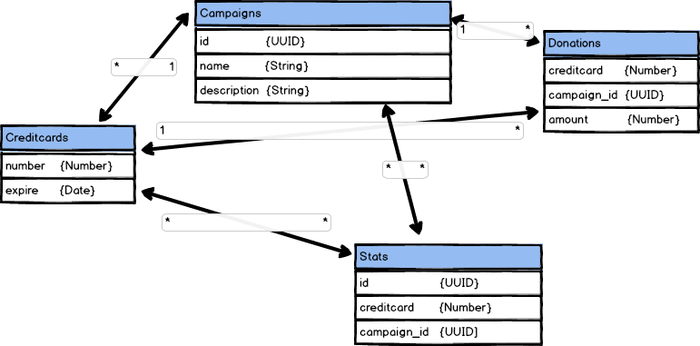

Opgaven er at lave et website med AJAX.
=======================================

I sidste ende har du en frontend som kan kommunikere asynkront med backend.
Du skal bygge et mini firefund fra start til slut (A-Z). Der er kampagner, donationer og statistik.

## rethinkdb2

I rethinkdb laver du følgende:

Vi starter med at bygge en relationel database, også kaldet en RDBMS.
En tabel med kampagner, en tabel med kredit kort, en tabel med betalinger og en tabel med statistik.
[Rethinkdb kan bruges på 2 måder](https://rethinkdb.com/docs/data-modeling/).
Til at starte med bruger vi link'ing af tabeller.

*\* betyder MANGE og 1 betyder én. Så en pil der starter med * og slutter med 1, betyder én til mange.*

[Link'ing af tabeller](https://rethinkdb.com/docs/table-joins/)

God fornøjelse og ses ved kode bordet.
